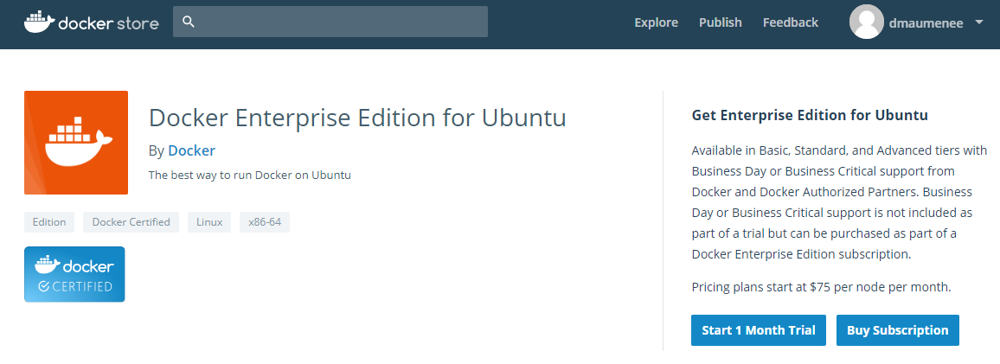
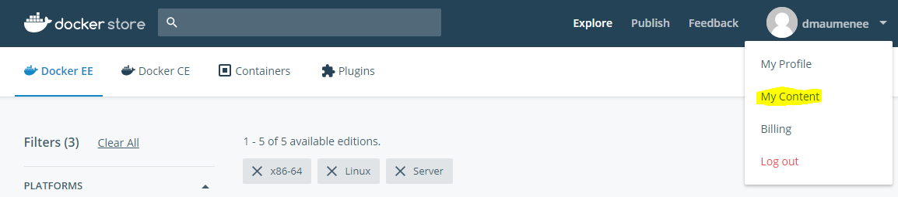
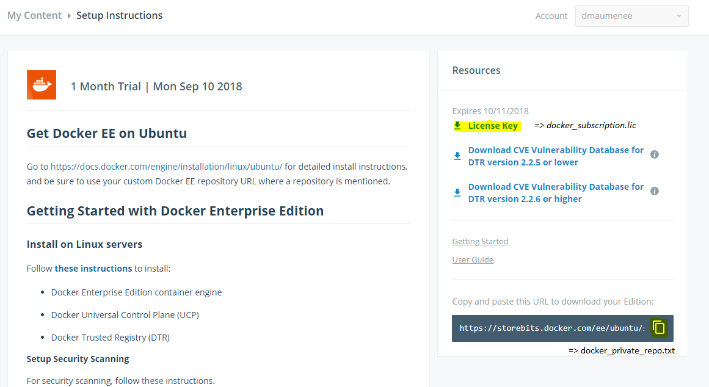

# Vagrant Docker EE

## Before lauching Vagrant UP

### Docker Enterprise Edition for Ubuntu Trial Licence

To deploy Docker EE you need a licence of "Docker Enterprise Edition for Ubuntu".
You can start a free trial on https://store.docker.com

2 files must be provided in the private-conf sub folder :

- docker_subscription.lic (download License Key)
- docker_private_repo.txt (https://storebits.docker.com/ee/ubuntu/sub-XXXXXXX)

See "My Content section" at https://store.docker.com (click on your account name to access the menu)

Copy the "URL to download your Edition" into a one line text file named docker_private_repo.txt.

### Tune the size of the cluster

According to the amount of RAM on your laptop tune the Vagrant file option :

 - MASTER_MEMORY (4096 minimum)
 - MASTER_CPUS  (2 mini, install hang with only 1 CPU)
 - NODE_COUNT (can be 0)
 - NODE_MEMORY (2048 minimum)

## UCP

setup-master.sh install both UCP and DTR on the master node 

The swarm-token is store into the folder /vagrant/generated-conf/swarm-join-token (shared by Vagrant). The worker nodes use it to join the cluster

### UCP access

https://192.169.33.10

user : admin

pass : admin1234

## DTR Docker Trusted Registry

https://192.169.33.10:9443

