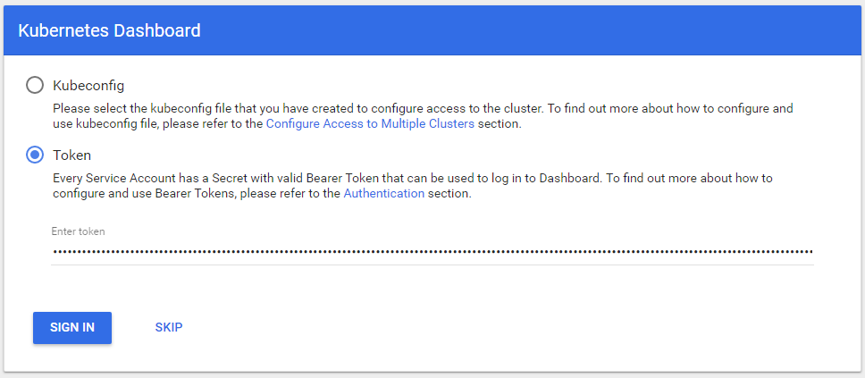
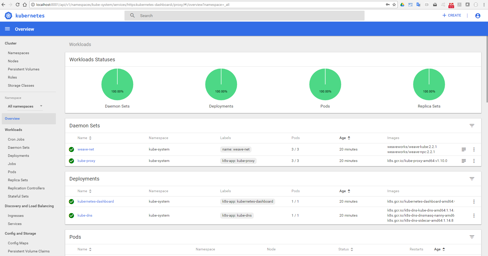

# Installation Kubernetes dernière version (1.10.0 au 31/03/2018) avec kubeadm + Dashboard

Contient la configuration Vagrant réalisant le provising des VM VirtualBox et la configuration automatisée d'un cluster Kubernetes via kubeadm
La configuration de l'ensemble du cluster est réalisée dans un unique fichier Vagrantfile (le nombre de node est configuré via la variable NODE_COUNT):
Les VM suivantes sont créés :
- master
- node1
- node2

Les commandes vagrant sont à lancer depuis le répertoire qui contient le Vagrantfile

## Exécution
```vagrant up```

## Arrêt
Ensemble du cluster
```vagrant halt```

Une machine en particulier
```vagrant halt <nom-machine>```

## Connexion aux VM
```vagrant ssh <nom-machine>```


Les IP sont déclarées dans le fichier provision\etc_hosts_extend utilisé pour enrichir les fichier /etc/hosts de l'ensemble des machines


# Détail du déploiement automatisé d'un cluster Kubernetes avec kubeadm
L'initialisation du cluster Kubernetes est piloté par le Vagrant file qui active **automatiquement** 3 scripts différents (localisés dans le répertoire provision)
- setup.sh (sur le master et tous les nodes)
- setup-master.sh (uniquement sur le master)
- setup-node.sh (uniquement sur les node)


## Installation de docker et de kubeadm sur le master et tous les nodes (setup.sh)
https://kubernetes.io/docs/setup/independent/install-kubeadm/

**Attention il faut que les driver cgroup utilisés par docker et par kubelet soient identiques.
Contrairement a ce qui est indiquée dans la doc c'est déjà le cas par défaut et il n'y a rien à faire.**
Si l'on procède au changement de cgroup driver de docker en systemd cela provoque l'erreur suivante dans la sortie de la commande **journalctl --all -xeu kubelet**  : 
```
Dec 03 18:10:49 master kubelet[9113]: error: failed to run Kubelet: failed to create kubelet: misconfiguration: kubelet cgroup driver: "cgroupfs" is different  from docker cgroup driver: "systemd"
```


## Init du cluster (setup-master.sh)
https://kubernetes.io/docs/setup/independent/create-cluster-kubeadm/

### kubeadm init
Init du cluster via une seule commande
Détail des options :
- apiserver-advertise-address 192.169.32.20 (pour forcer l'utilisation de l'IP accessible depuis les nodes)
- pod-network-cidr=192.168.0.0/16 (pour le bon fonctionnement du driver Calico)
- token 2c71ab.5292a7678e4fc5a9 (pour avoir un token fixe car il est utilisé aussi lors du join)
- token-ttl 0 (pour avoir un token qui n'expire pas)


### Installing a pod network "Weave Net" (avec Calico le dashboard ne fonctionne pas)

### Dashboard
Le déploiement du dashboard est réalisé à partir du descripteur suivant :
https://raw.githubusercontent.com/kubernetes/dashboard/master/src/deploy/recommended/kubernetes-dashboard.yaml

Un user admin-user est créé à partir du fichier [admin-user.yaml](./provision/admin-user.yaml)
Le rôle cluster-admin est rattaché à se user via l'API rbac à partir du fichier [clusterRoleBinding.yaml](./provision/clusterRoleBinding.yaml).

## Join the nodes (setup-node.sh)
Rattachement des nodes au cluster
Détail des options :
- token le token (fixe pour simplifier l'automatisation de l'installation)
- discovery-token-unsafe-skip-ca-verification (pour ne pas avoir à préciser le discovery-token-ca-cert-hash et simplifier l'automatisation de l'installation)

# Utilisation du cluster

## connexion en ssh sur le master
```vagrant ssh master```

## commande kubectl
- Lister les noeuds : 
```kubectl get nodes```
Lors de l'init il faut attendre quelques minutes avant d'obtenir le résultat suivant
```
vagrant@master:~$ kubectl get nodes
NAME      STATUS    ROLES     AGE       VERSION
master    Ready     master    2h        v1.10.0
node1     Ready     <none>    2h        v1.10.0
node2     Ready     <none>    2h        v1.10.0
```

- vérifier si l'ensemble des pods sont OK
```
vagrant@master:~$ kubectl get pods --all-namespaces
NAMESPACE     NAME                                    READY     STATUS    RESTARTS   AGE
kube-system   etcd-master                             1/1       Running   0          2h
kube-system   kube-apiserver-master                   1/1       Running   0          2h
kube-system   kube-controller-manager-master          1/1       Running   0          2h
kube-system   kube-dns-86f4d74b45-txh44               3/3       Running   0          2h
kube-system   kube-proxy-hpwzf                        1/1       Running   0          2h
kube-system   kube-proxy-rwnd7                        1/1       Running   0          2h
kube-system   kube-proxy-ztbvh                        1/1       Running   0          2h
kube-system   kube-scheduler-master                   1/1       Running   0          2h
kube-system   kubernetes-dashboard-7d5dcdb6d9-r2hhr   1/1       Running   0          2h
kube-system   weave-net-4s744                         2/2       Running   0          2h
kube-system   weave-net-7mmjh                         2/2       Running   0          2h
kube-system   weave-net-ts5sv                         2/2       Running   0          2h
```

## se connecter au Dashboard

### Proxy à partir du poste qui va lancer le navigateur

L'accès au dashboard nécessite de disposer de kubectl sur le poste qui va lancer le navigateur. Il n'est pas possible d'accéder au Dashboard si la commande proxy est lancée à partir du kubectl présent dans la VM.

**Télécharger kubectl pour votre plateforme et mettez à jour votre path.**
https://kubernetes.io/docs/tasks/tools/install-kubectl/#install-kubectl-binary-via-curl

Se mettre à la racine du répertoire kubeadm-vagrant (le fichier ./generated-conf/admin.conf a généré via la script de provisionning du master).
```
kubectl --kubeconfig ./generated-conf/admin.conf proxy
```
Sous Windows, vous pouvez lancer la commande ```proxy.cmd``` présent à la racine du répertoire kubeadm-vagrant.

### Connexion au Dashboard

Le Dashboard est accessible depuis cettee URL :
http://localhost:8001/api/v1/namespaces/kube-system/services/https:kubernetes-dashboard:/proxy



Copier/Coller le contenu du champs token présent dans le fichier ***./generated-conf/admin-user-token.txt*** initialisé par le script setup-master.

Enjoy !

