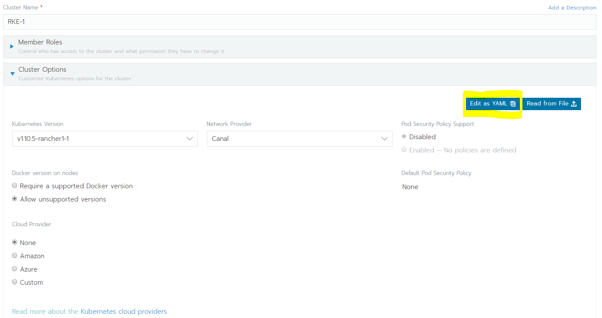
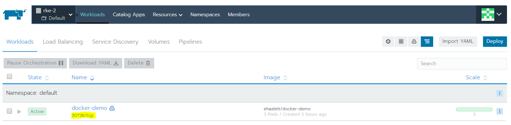

# Rancher 2 with Vagrant

The vagrant script :
- init the VMs and install Docker
- install the rancher server on master node

## Rancher Server
Rancher server is installed on master

Admin UI URL : https://192.168.33.30

Admin Password : admin

See https://rancher.com/docs/rancher/v2.x/en/quick-start-guide/

## Create a Kubernetes cluster

Add a cluster **Custom** with rancher admin UI


**WARNING** : the VM have two differents network interface, one for internet access and another for internal access. Sadly the network plugin use the wrong one.

It's **MANDATORY** to specify the right interface (named enp0s8 to the plugin).
To do this you **must** click on *edit yaml* button to specify the right interface to the network provider.



```yaml
# To specify flannel interface

   network:
     plugin: flannel
     flannel_network_provider:
       iface: enp0s8

# To specify flannel interface for canal plugin

   network:
     plugin: canal
     canal_network_provider:
       iface: enp0s8
```   

Test on rancher v2.0.6 with both with **Canal** (the default Network Driver with v2.0.6) and **Flannel**

## Deploy the sample app
Sample application can be deployed with the import yaml button with this [docker-demo-rancher.yaml](./demo/docker-demo-rancher.yaml) file.

To launch the application use le link with the genereted port.


You can use the IP of any node of the cluster to access the pod even if no pod runs on the node.